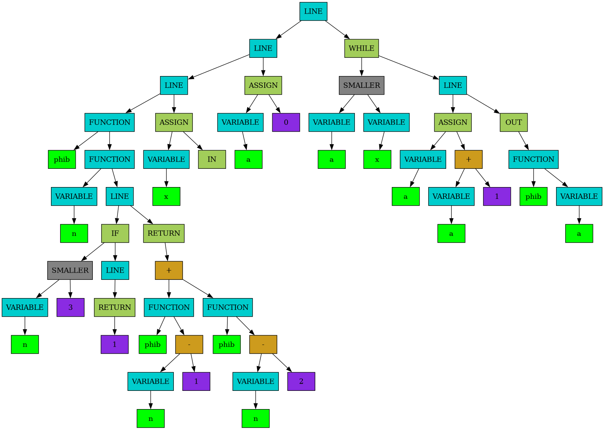

# Ultimate Programming Language
С-подобный язык программирования

## Требования

- GCC версии 15.2.1 и выше
- GNU make версии 4.4.1 и выше
- dot grapwiz версии 14.0.5 и выше

## Запуск

```bash
make all
```
или
```bash
make frontend_b
make middlend_b
make backend_b
```

## Использование

```bash
make run
```
или
```bash
make frontend
make middlend
make backend
./asm.out
./spu.out
```
или
```bash
./build/descent.out <code filename> <tree filename>
./build/compilator.out <tree filename> <out filename>
./asm.out
./spu.out
```

## Описание

Проект состоит из **frontend**, **middlend** и **backend**.

На этапе **frontend** программа использует **рекурсивный спуск** чтобы преобразовать программу пользователя в структуру дерева. На этом этапе улавливается большая часть ошибок.

На этапе **middlend** программа оптимизирует полученное ранее дерево, выполняя, например **свертку констант** и **dead code ellimination**.

Пример программы и ее дерева после оптимизации:

```
fact(n)   #recursive factorial function
{
    if(n == 1)
    {
        return 1;
    };

    return n * fact(n - 1);
};

out(fact(in));
```



Далее дерево передается в **backend**, где переводится в Ассемблерный код для [**SPU** (Soft Processor Unit)](https://github.com/MasterVAE/MIPT_Stack)